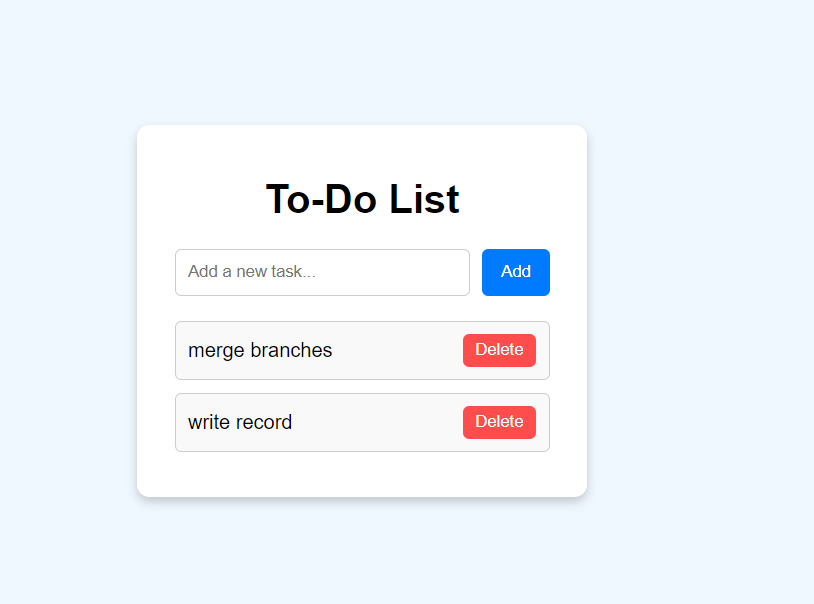

# To-Do List App

A simple and responsive To-Do List application built using **HTML**, **CSS**, and **JavaScript**.

## Features

- Add tasks to the list.
- Delete tasks from the list.
- Responsive design for both desktop and mobile devices.

## Technologies Used

- **HTML**: For the structure of the app.
- **CSS**: For styling and layout.
- **JavaScript**: For interactivity and functionality.

## How to Use

1. Clone the repository:
   ```bash
   git clone https://github.com/AlenChettiar/todo-list
   ```
2. Navigate to the project directory:
   ```bash
   cd todo-list
   ```
3. Open `index.html` in your browser:
   ```bash
   start index.html
   ```

## Project Structure

```
.
├── index.html       # Main HTML file
├── style.css        # CSS file for styling
├── script.js        # JavaScript file for functionality
```

## Screenshots



## License

This project is licensed under the MIT License. Feel free to use and modify it as needed.

---

### Author

Created by **Alen Chettiar**.  
Feel free to reach out at [alen.chettiar.25@gmail.com](mailto:your-email@example.com).
